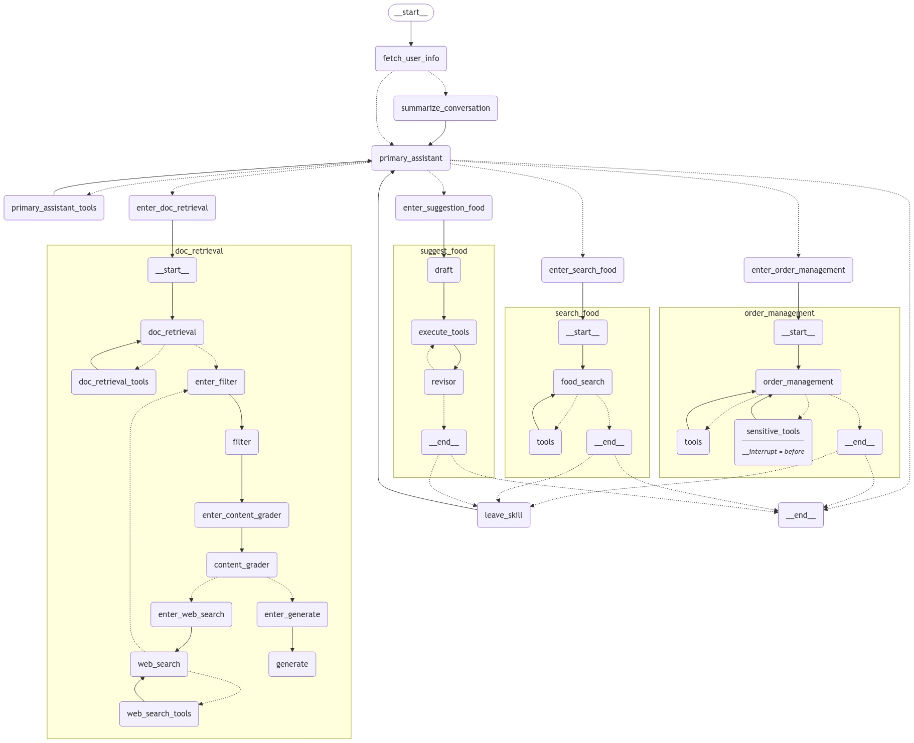

# 🍽️ Food Chatbot - AI Food Assistant 🤖
A smart AI-powered chatbot for **food recommendations, order management, and food information retrieval** using **LangGraph, LangChain, and Google Gemini AI**.

---

## 🚀 Features
✅ **Order Management** – Track and manage food orders.  
✅ **Food Search** – Find available dishes in different restaurants.  
✅ **Food Recommendations** – Get smart food suggestions based on preferences.  
✅ **Document Retrieval** – Answer food-related questions using a knowledge base.  
✅ **Multi-agent Architecture** – Uses specialized AI agents for efficient processing.  

---

## 🛠️ Installation & Setup

### 1️⃣ Clone the repository
```bash
git clone https://github.com/M0BiN/food-chatbot.git
cd food-chatbot
```
### 2️⃣ Install dependencies
```bash
pip install -r requirements.txt
```

### 3️⃣ Set up environment variables
Create a .env file and add:
```bash
OPENAI_API_KEY = XXX
LANGCHAIN_API_KEY = XXX
TAVILY_API_KEY = XXX
GOOGLE_API_KEY = XXX
LLAMA_CLOUD_API_KEY = XXX
PYTHONUTF8=1
```
### 4️⃣ Run the chatbot
```bash
chainlit run app.py -w
```

### 📂 Project Structure
```bash
📂 food-chatbot
├── 📂 agents                  # AI Agents handling specific tasks
│   ├── doc_retrieval_agent.py
│   ├── order_management_agent.py
│   ├── food_search_agent.py
│   ├── food_suggestion_agent.py
│   ├── summarize_conversation_agent.py
├── 📂 graphs                  # LangGraph sub-graphs
│   ├── part_1_graph.py
│   ├── part_2_graph.py
│   ├── part_3_graph.py
│   ├── part_4_graph.py
│   ├── supergraph.py
├── main.py                    # Entry point
├── requirements.txt            # Dependencies
├── README.md                   # Project documentation
└── .env                        # Environment variables
```

## 🛠️ Chatbot Architecture

This is an overview of the chatbot’s architecture and workflow:



### 📢 Contribution
Contributions are welcome! Please open an issue or submit a pull request. 😊